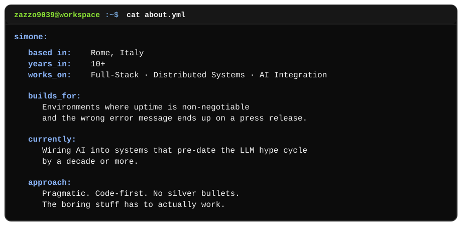
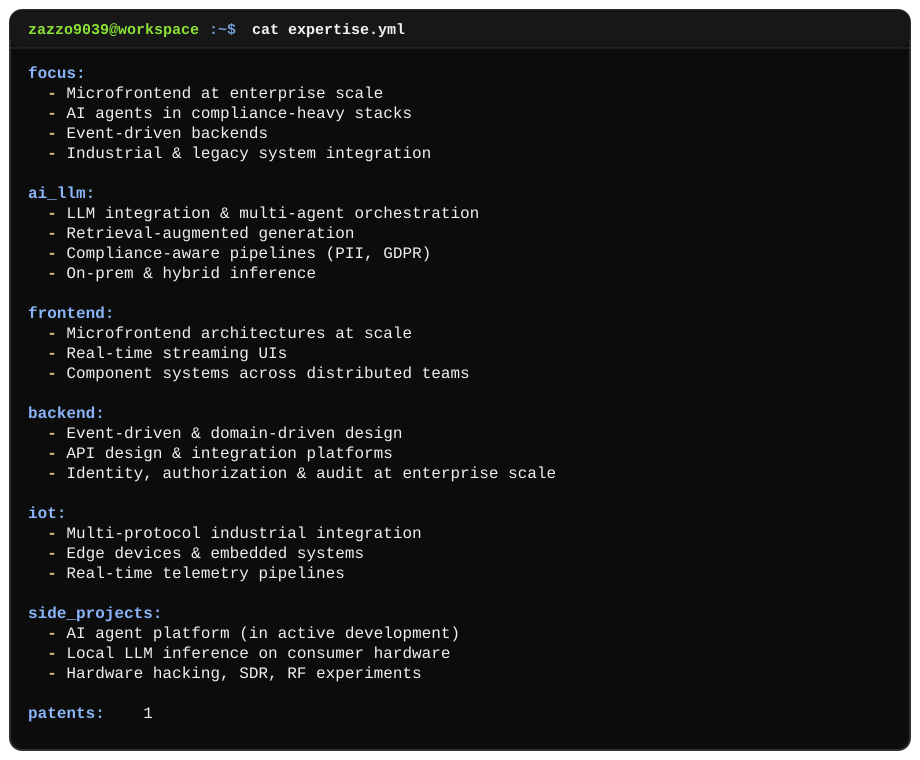

  

---

## ✨ About Me

  

## 💎 Core Expertise

 

  

---

> [!IMPORTANT]
> Most of my production work lives in private enterprise repositories, so this profile focuses on public work and high-level technical capabilities.

## 🎯 Focus

Full-Stack · Distributed Systems · AI Integration · Microfrontend at Scale · Industrial IoT

## 🌱 GitHub Activity

  

